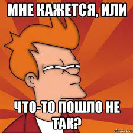

# Elementary Geometric Reduction

### Проблема

Если человек не знает математику на уровне высшей школы, то бывает очень трудно разобраться, что означает то или иное выражение, записанное в математической нотации.

> Стандартное решение этой проблемы - изучение математики.

Есть прекрасные курсы, упрощающие эту задачу. Начиная с Khan Academy, и многие другие. 

Однако всё равно процесс должен был бы занять годы, чтобы начать ориентироваться в этом уверенно.

Кроме того, даже при творческой подаче материала, базовый подход остается в целом прежним: есть математическая нотация, и, подобно музыкальным нотам, нужно выработать автоматический навык ее чтения.

И хочется посмотреть на проблему out of the box, и подумать, а нет ли возможности реализовать инструмент, который бы упрощал этот процесс и позволял сделать его комфортнее и быстрее. 

Кроме того, чтобы этот инструмент позволял без предварительной подготовки базово понять, что делает то или иное выражение как бы на уровне мыслительного навыка, а не просто словесных объяснений (которые способна дать нейросеть).

Поэтому тем, кому это важно и интересно предлагаю налить чашечку кофе и попробовать посмотреть на проблему как инопланетяне, которые не хотят тратить годы на изнурительное узучение языка (математического), а хотят сделать как бы переводчик. Чтобы даже если процесс все-таки занял все равно годы, они бы прошли не в изнурении. 

И подумать, насколько это реально и актуально.

Поэтому попробуем посмотреть на проблему сбоку, творчески. 

> Сразу хочется оговориться, что если лично вам достаточно  объяснений, которые может дать GPT, то, возможно, что проблема для вас неактуальна. Кроме того, объяснения GPT все-таки не гарантированно верны, и в случае точных рассуждений может быть опасно обращаться за ней к интерпретациям и на них (не обладающих гарантией) строить свои умозаключения. 

## Погружение в проблему

Когда мы не понимаем какое-то явление, например, в медицине, мы можем устроить "гуляние по Википедии" и статьям, и за несколько часов, иногда дней, разобраться в проблеме на достаточно адекватном уровне. 

И тогда уже ориентироваться, как поступать дальше. Идти к врачу, на обследование, сдачу анализов, сходить в аптеку. 

С математической нотацией так не получится. Перекрестные ссылки "в Википедии" (статьи в Сети и так далее) как правило не позволяют раскрыть смысл читаемого без знаний необходимого уровня нотации. 

Почему так?

Возможно что-то где-то когда-то пошло не так?

В математике есть два базовых действия, к которым всё сводится - это + и -.

И еще есть равенство, как тождество.

И кажется странным, на первый взгляд, вопрос - почему тогда всё так сложно?

Почему математическая нотация трудно переводима в эти два элементарных действия с множествами?

Есть ли возможность реализовать систему, позволяющая математическое выражение - алгербры или других дисциплин - переводить в визуализацию
действий с множествами?

И тогда и изучение математики, и восприятие формул в том или ином контексте стало бы проще?

Это и есть идея такой платформы (как программного продукта). Иметь возможность ввести произвольное математическое выражение, и увидеть
варианты того, что происходит с множествами, обозначенными буквами, с учетом того, что может быть подано на вход в качестве переменных.

Видя выражение вида f = x^2 + y^2*abc не с точки зрения необходимости достаточных переменных в числах, а в плане каковы базовые несколько вариантов редукции к элементарному трехмерному пространству.

Чтобы понимать, каковы маршруты трансформации множеств в том или ином контексте.

Если выражение, например, f = x^2 - y^2*abc, то если x (мысля его сразу как шар в трехмерном пространстве) меньше y, или a, или b, или c, то это один маршрут преобразования множеств.

А если больше - то другой.

И из множества вариантов на графиках видеть основной пул вариантов, которые, скорее всего, актуальны. И видеть вариативность использования
того или иного выражения в каком-то контексте задачи.

Запрос у ChatGPT
нет гараний

здесь же ничего не интерпретирует, а только визуализирует трансформацию множеств