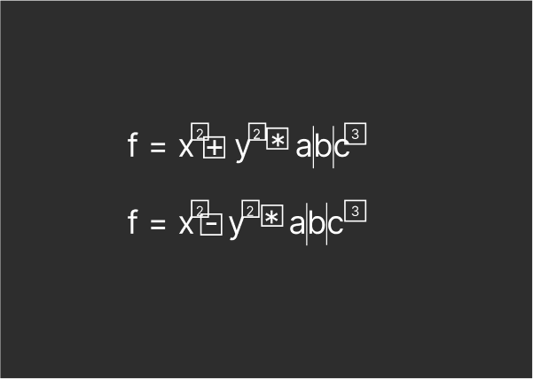
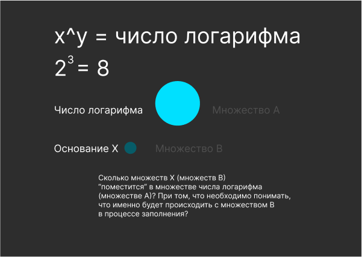
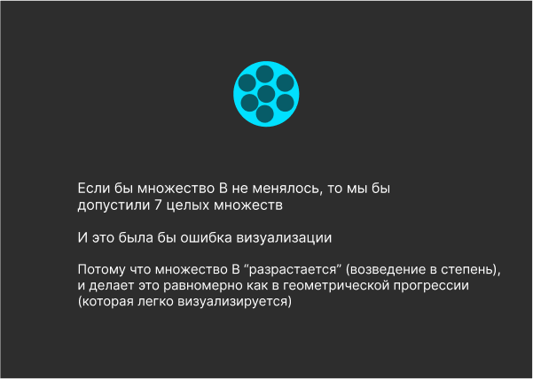
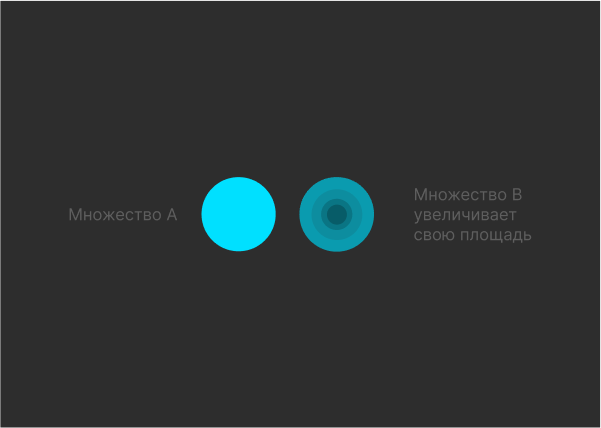
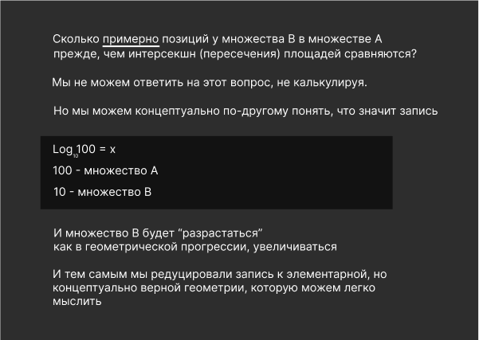
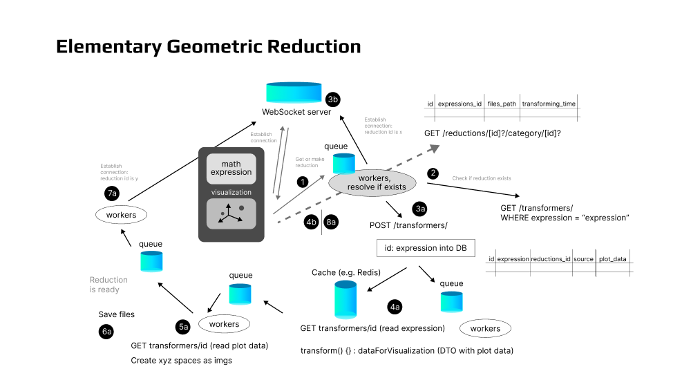

# Elementary Geometric Reduction

### Проблема

Если человек не знает математику на уровне высшей школы, то бывает очень трудно разобраться, что означает то или иное выражение, записанное в математической нотации.

> Стандартное решение этой проблемы - изучение математики.

Есть прекрасные курсы, упрощающие эту задачу. Начиная с Khan Academy, и многие другие. 

Однако всё равно процесс должен был бы занять годы, чтобы начать ориентироваться в этом уверенно.

Кроме того, даже при творческой подаче материала, базовый подход остается в целом прежним: есть математическая нотация, и, подобно музыкальным нотам, нужно выработать автоматический навык ее чтения.

И хочется посмотреть на проблему out of the box, и подумать, а нет ли возможности реализовать инструмент, который бы упрощал этот процесс и позволял сделать его комфортнее и быстрее. 

Кроме того, чтобы этот инструмент позволял без предварительной подготовки базово понять, что делает то или иное выражение как бы на уровне мыслительного навыка, а не просто словесных объяснений (которые способна дать нейросеть).

Поэтому тем, кому это важно и интересно предлагаю налить чашечку кофе и попробовать посмотреть на проблему как инопланетяне, которые не хотят тратить годы на изнурительное узучение языка (математического), а хотят сделать как бы переводчик. Чтобы даже если процесс все-таки занял все равно годы, они бы прошли не в изнурении. 

И подумать, насколько это реально и актуально.

Поэтому попробуем посмотреть на проблему сбоку, творчески. 

> Сразу хочется оговориться, что если лично вам достаточно  объяснений, которые может дать GPT, то, возможно, что проблема для вас неактуальна. Кроме того, объяснения GPT все-таки не гарантированно верны, и в случае точных рассуждений может быть опасно обращаться за ней к интерпретациям и на них (не обладающих гарантией) строить свои умозаключения. 

## Погружение в проблему

Когда мы не понимаем какое-то явление, например, в медицине, мы можем устроить "гуляние по Википедии" и статьям, и за несколько часов, иногда дней, разобраться в проблеме на достаточно адекватном уровне. 

И тогда уже ориентироваться, как поступать дальше. Идти к врачу, на обследование, сдачу анализов, сходить в аптеку. 

С математической нотацией так не получится. Перекрестные ссылки "в Википедии" (статьи в Сети и так далее) как правило не позволяют раскрыть смысл читаемого без знаний необходимого уровня нотации. 

Почему так происходит?

Возможно что-то где-то когда-то пошло не так?

Есть базовые предпосылки дальнейшего рассуждения. 

В математике все действия осуществляются только с множествами. 

Цифры и числа - это обозначения множеств и их состояний (например, с этой точки зрения, верно ли, что число 0 - это множество, которого больше или еще нет?). 

В математике есть **только два** базовых действия, к которым сводится всё остальное: это + и -, сложение и вычитание.

Кроме того, есть еще базовые операции - установление равенства (тождества) множеств, а так же утверждения, что какое-то множество больше или меньше другого (других).

И отсюда вытекает простой вопрос: **возможно ли** любое математическое выражение редуцировать до этих базовых действий и операций? С точки зрения осмысления, что происходит с имеющимися множествами в процессе действий, предлагаемых математическим выражением?

## Визуализация

Поскольку речь идет о визуализации упрощенных отношений множеств, давайте посмотрим это на примере.

Например, выражение 2 * 5. 

В обычной визуализации это выглядело бы как 

Такая визуализация начинает давать сбой, когда речь идет не о единицах или на крайний случай десятках, а о сотнях и более элементов.

Нас же в этом случае интересовала бы визуализация вида a * b

и понимание, что c (c = a * b) стало больше. 

И этот факт позволил бы понять - в результате действия итоговое множество увеличилось.

То есть мы не пытаемся посчитать, что делает выражение. А только понять его базовый смысл - итоговое (или промежуточное) множество - увеличилось, уменьшилось, осталось прежним.

И что утверждается в отношении других множеств: они равны, какое-то меньше или больше другого.

Другой пример f = x^2+y^2*abc^3

Мы вычисляем "операнды", действия, порядок преобразований (множеств).

Выполняем их с точки зрения, что перед нами положительные числа.

Получаем, что f увеличилось.

Однако, есть базовый сценарий, если какое-то или какие-то операнды отрицательные настолько, что f уменьшится. 

Нам необязательно знать, какой именно и насколько отрицателен, но мы 
можем увидеть эти два базовые сценария.

f увеличивается или уменьшается. 

И увидеть промежуточные операции.

x = x * x

y = y * y

Значит отрицательным числом, ведущим "в минус" может быть либо a, либо b, либо c (из выражения, не визуализации. В визуализации буквы а, b, c условны и могут быть отброшены)

c = c * c * c

### "Математический кретинизм"

Допустим, что есть базовое простое объяснение, что такое логарифм и зачем он нужен.

Но мне всё равно непонятно или непривычно выполнять те ментальные операции со знаками (буквами), которые предлагается делать. 

Не удается это запомнить. 

Назовем это "математическим кретинизмом". Что-то наподобие дислексии, только с математическими операциями. 

Как тогда можно еще представить логарифм, чтобы было элементарно понятно?

Можно ли увидеть это как динамику множеств в пространстве xyz?

Что вообще делает логарифм?

Позволяет понять, в какую степень возвести какое-то число (основание), чтобы получилось данное число логарифма.

Например, чтобы получилось 100, нужно основание 10 возвести в квадрат.

То есть у нас есть операция возведения в степень, или умножение на само себя какое-то количество раз, или операция сложения.

И неважно, если мы ошибаемся, сколько раз множество B может разрастись.

Наша цель была понять, как именно помыслить и запомнить эту операцию.

И теперь возьмем прикладной случай понимания логарифма.

Например, оценка сложности алгоритма.

Допустим, у нас есть оценка сложности алгоритмов O(n), O(log n) и O(n^2).

Как понять, какой эффективнее?

n эффективнее n^2. А log n?

Предположим, что у нас 5 000 входных элементов (n)

log n, допустим, по основанию 10, значит, что 10 будет "разрастаться"
сколько-то раз.

10^3 это - 1 000, 10^4 - 10 000, и мы можем понять, что это будет 10^3.5. 

То есть мы можем возвести 10 в степень 3.5 и не "поперхнуться".

Иначе говоря, 10\*10\*10 и * (10*0.5, т.е. на 5) = 5 000

И тогда сразу увидим, что 3.5 на порядок меньше, чем 5 000 или 5 000^2.

И в этом и есть смысл изменения восприятия математической нотации.

Обрести возможность мыслить элементарной геометрией множеств при восприятии математической записи.

## Матрешки

Гипотеза состоит в том, что вся математика ("чуть более, чем полностью"), состоит из паттерна Декоратор. 

И вся целиком напоминает матрешку. 

Однако, незнание (непонимание на уровне "зазубренности", подсознания) некоторых слоев делает невозможным использование формул и знаков.

И так же, как нам необязательно понимать концепцию логарифма в привычном объяснении, чтобы понять, что он делает, возможно, необязательно понимать и другие концепции, если они редуцированы в элементарную геометрию верно, правильно?

И тогда, образно говоря, сидя перед нотами, быть в состоянии смочь уловить базовую мелодию какого-то рассуждения, доказательства. "Услышать ее", не зная точных значений.

И, продолжая метафору, имея перед собой клавиши пианино (программный код) ее подобрать. Или даже иметь подсказки, какие клавиши нажать, чтобы ее сыграть.

Это не будет виртуозная игра на фортепиано, но это будет редукция сложных быстрых нот в примитивную (элементарную) мелодию. Которая однако будет верна и будет понимание, это forte, это piano, тут такая нота, а тут такая. Чтобы в целом мелодия отразила сложенейшую музыку композитора. Просто в упрощенном виде главной мелодии.

И тем самым мы сможем воспринимать иначе то, как преподается (и учится) математическая нотация и математические действия/операции.

## Сервис

И кажется странным, на первый взгляд, вопрос - почему тогда всё так сложно?

Почему математическая нотация трудно переводима в эти два элементарных действия с множествами?

Есть ли возможность реализовать систему, позволяющая математическое выражение - алгербры или других дисциплин - переводить в визуализацию
действий с множествами?

И тогда и изучение математики, и восприятие формул в том или ином контексте стало бы проще?

Это и есть идея такой платформы (как программного продукта). Иметь возможность ввести произвольное математическое выражение, и увидеть
варианты того, что происходит с множествами, обозначенными буквами, с учетом того, что может быть подано на вход в качестве переменных.

Видя выражение вида f = x^2 + y^2*abc не с точки зрения необходимости достаточных переменных в числах, а в плане каковы базовые несколько вариантов редукции к элементарному трехмерному пространству.

Чтобы понимать, каковы маршруты трансформации множеств в том или ином контексте.

Если выражение, например, f = x^2 - y^2*abc, то если x (мысля его сразу как шар в трехмерном пространстве) меньше y, или a, или b, или c, то это один маршрут преобразования множеств.

А если больше - то другой.

И из множества вариантов на графиках видеть основной пул вариантов, которые, скорее всего, актуальны. И видеть вариативность использования
того или иного выражения в каком-то контексте задачи.

Запрос у ChatGPT
нет гараний

здесь же ничего не интерпретирует, а только визуализирует трансформацию множеств